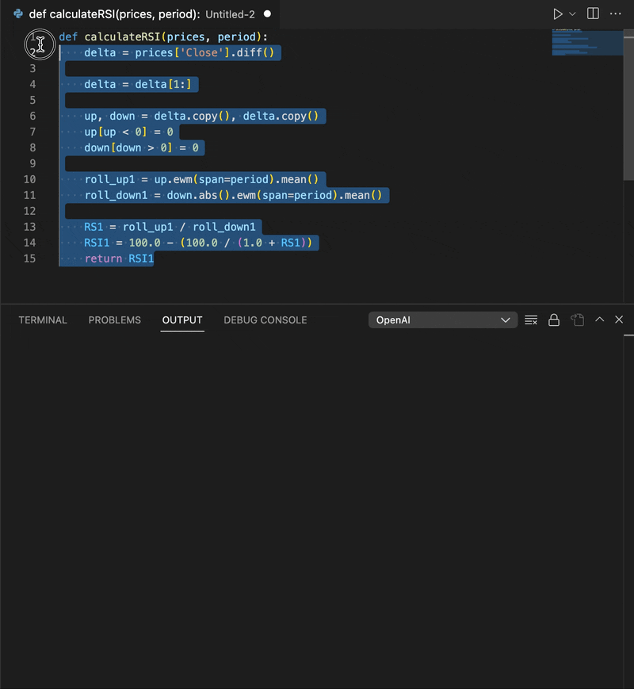
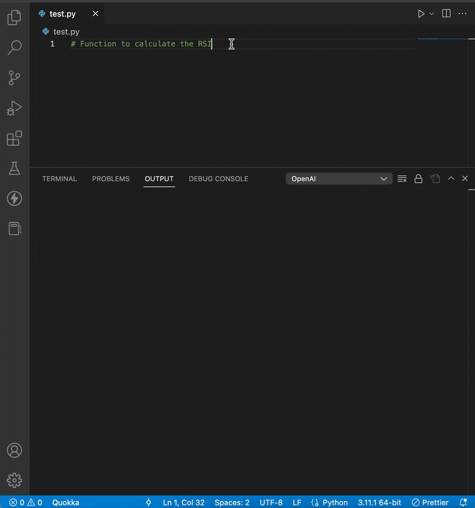

# VS ChatGPT README

VS ChatGPT is a plugin for Visual Studio Code that integrates the powerful ChatGPT language model into the popular code editor. With VS-ChatGPT, developers can leverage the capabilities of ChatGPT to generate snippets, suggest completions for open-ended questions, and even write entire functions or modules.

## Usage

Run the command `ChatGPT: Text completions` to run _OpenAI GPT-3_

### Commands

#### **Explain Regular Expression**

Ask OpenAI to explain a regular expression by selecting the code and running the command "ChatGPT: Explain regular expression."

#### **Add comments to code snippet**

Ask OpenAI to comment on the selected code by running the command "ChatGPT: Add comments."

#### **Explain code snippet**

Ask OpenAI to explain the selected code by running the command "ChatGPT: Explain code snippet."

#### **Generate unit tests**

Ask OpenAI to generate unit tests for the selected code by running the command "ChatGPT: Generate unit tests."

## Requirements

To use VS ChatGPT you must have an [OpenAI account](https://beta.openai.com/) and have generated an [API Secret Key](https://beta.openai.com/account/api-keys).

## Extension Settings

This extension contributes the following settings:

- `vs-chatgpt.apikey`: Your OpenAI secret API key.
- `vs-chatgpt.model`: OpenAI GPT-3 model ([Read more about models](https://beta.openai.com/docs/models/gpt-3)).
- `vs-chatgpt.max_tokens`: The maximum number of tokens to generate in the completion. Most models have a context length of 2048 tokens (except for the newest models, which support 4000) ([Read more about tokens](https://beta.openai.com/docs/models/gpt-3)).

## Shortcuts

Default shortcuts:

- Windows: `alt+ctrl+shift+g`
- Mac: `alt+cmd+shift+g`

## Release Notes

### 1.2.0

- New feature: Explain Regular Expression
- New feature: Add comments to code snippet
- New feature: Explain code snippet
- New feature: Generate unit tests

### 1.1.0

- Request #1: Added shortcusts.
- New feature: Send the selected text to ChatGPT via context menu or command palette.

### 1.0.0

First release.
